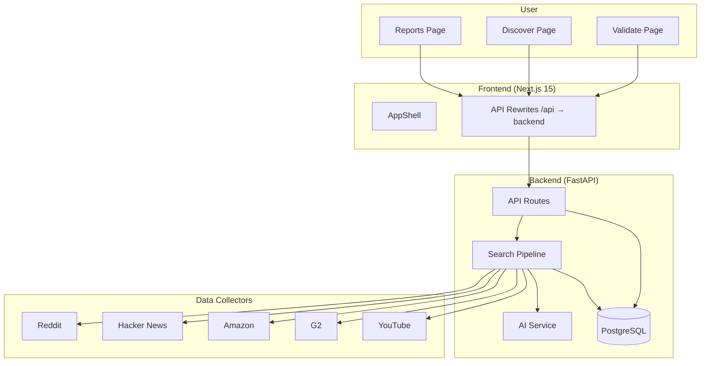
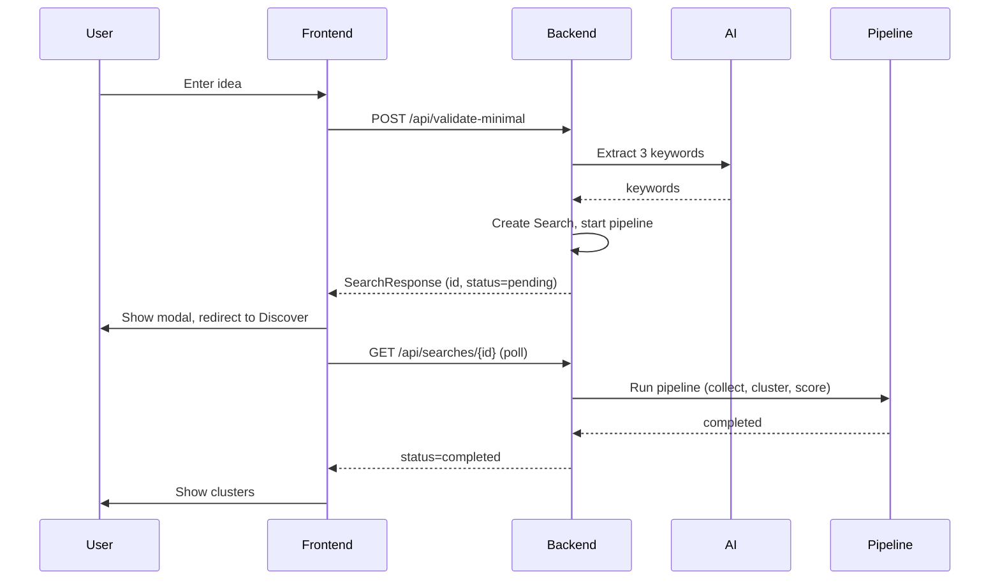

# GapLens Architecture

## Overview

GapLens is a full-stack opportunity discovery engine. The frontend (Next.js) talks to the backend (FastAPI) via API rewrites; the backend orchestrates data collection, AI analysis, and persistence.

## High-Level Data Flow

## Validate Flow

## Discover Flow

1. User enters query (or arrives from Validate with `search_id`).
2. Frontend calls `POST /api/searches` or uses existing search.
3. Backend creates `Search` record, starts pipeline in background.
4. Frontend polls `GET /api/searches/{id}` until `status=completed` or `failed`.
5. On completion, frontend fetches `GET /api/searches/{id}/clusters`.
6. User selects cluster → `GET /api/clusters/{id}/report`.
7. Optional: `POST /api/clusters/{id}/prd` for PRD draft.

## Key Directories

| Path | Purpose |
|------|---------|
| `frontend/src/app/` | Next.js app router pages |
| `frontend/src/components/` | Shared UI components |
| `frontend/src/lib/` | API client, utils, analytics |
| `frontend/src/contexts/` | Workspace, theme, refresh state |
| `backend/app/api/` | FastAPI routes |
| `backend/app/core/` | Config, database |
| `backend/app/services/` | Pipeline, AI, collectors |
| `backend/app/models/` | SQLAlchemy models |

## Shared Utilities (Post-Audit)

- `frontend/src/lib/scoreUtils.ts` — Score/authenticity color helpers
- `frontend/src/lib/sources.ts` — Unified source config (SearchBar, landing)
- `frontend/src/components/RotatingTips.tsx` — Rotating tips (Validate, Reports)
- `frontend/src/components/AuthenticityBadge.tsx` — Authenticity display
- `frontend/src/components/FocusTrap.tsx` — Modal focus trap

## Storage Keys

All localStorage keys use `gaplens-*` prefix:

- `gaplens-theme` — Light/dark theme
- `gaplens-active-workspace-id` — Active workspace
